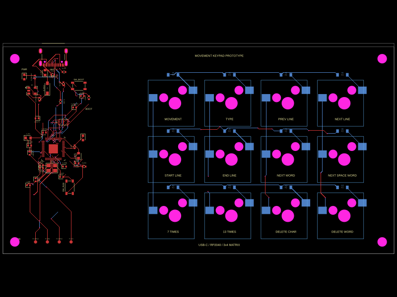

# programmers-keyboard
Gerbers for a keyboard THAT YOU USE EVERY DAY FOR WORK TO PERFORM YOUR PROFESSIONAL JOB, WHICH YOU TAKE SERIOUSLY ENOUGH TO DO A GOOD JOB

----

categories of keys:
- cursor and page movement
- signals (quit program, sleep program, shutdown)
- math ÷ ≤ × = –
- classic programming symbols ([{ lambda dereference_pointer address_of comment assignment heredoc enclose_a_single_idea function_composition
- regular expressions start end all any
- concept separation _      
- incantation assistance (search incantation history, complete the incantation I've started typing)
- several pastebins push pop see

Pictures of those tables are in [`pictures of the keypads`](pictures%20of%20the%20keypads). They are generated from ordinary Idris2 in [`render-keypads`](render-keypads): Idris2 writes the SVG layouts, then standard Debian tools produce PNG previews and raw PGM (P5) copies.

## First routed PCB segment: Movement keypad

The first deliberately small hardware segment is now checked in:

- [complete Gerber ZIP](fabrication/movement-prototype-gerbers.zip)
- [extracted Gerber, drill, BOM, and placement files](fabrication/movement-prototype-gerbers)
- [routed PCB preview](fabrication/movement-prototype-pcb.svg)
- [schematic preview](fabrication/movement-prototype-schematic.svg)
- [readable netlist](fabrication/movement-prototype-readable.netlist)
- [tscircuit source](pcb/movement-prototype.tsx)

It is a 132 mm × 70 mm USB-C/RP2040 prototype with twelve hot-swap key positions, twelve diodes, a 3×4 matrix, and four mounting holes. The committed package contains ten Gerber layers, plated and non-plated drill files, a BOM, and pick-and-place data. The source and validation procedure are documented in [`pcb`](pcb).

This is a routing prototype, not a claim that the board is ready to order. Switch mechanics, USB protection, enclosure clearances, firmware, component availability, and final electrical review still matter.

---

Because I know you wouldn't just triple-ambiguously strugglebus piano chords onto a qwerty typewriter for literally half a century no matter how much ambiguity and complex workarounds that causes you to make in crucial designs, simply because that's just the way it's always been done. after all, you're a hacker!
