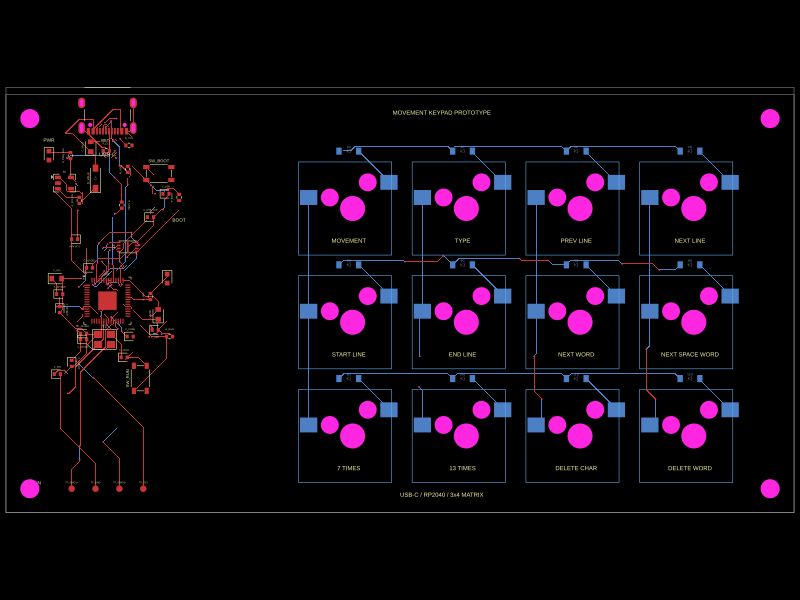

# Programmer’s Keyboard

A modular keyboard project built around dedicated keypads for programming, mathematics, navigation, and command-heavy work.

The repository contains generated keypad layouts and the first routed hardware segment. It is experimental hardware, not a finished keyboard product.

## Key groups

- cursor and page movement
- process and system signals
- mathematical symbols such as `÷`, `≤`, `×`, `=`, `−`, and `⇒`
- programming symbols and operations
- regular-expression anchors and quantifiers
- concept separation and naming
- command-history search and completion
- several visible paste buffers

Layout previews are in [`pictures of the keypads`](pictures%20of%20the%20keypads). [`render-keypads`](render-keypads) generates them from ordinary Idris 2: Idris writes SVG layouts, then standard Debian tools produce PNG previews and raw PGM copies.

## Movement keypad prototype

The first routed segment is a 132 mm × 70 mm USB-C/RP2040 board with:

- twelve hot-swap key positions
- twelve diodes
- a 3×4 key matrix
- four mounting holes

Files:

- [Gerber ZIP](fabrication/movement-prototype-gerbers.zip)
- [Gerber, drill, BOM, and placement files](fabrication/movement-prototype-gerbers)
- [PCB preview](fabrication/movement-prototype-pcb.svg)
- [schematic preview](fabrication/movement-prototype-schematic.svg)
- [readable netlist](fabrication/movement-prototype-readable.netlist)
- [tscircuit source](pcb/movement-prototype.tsx)
- [source and validation notes](pcb)

## Status

This board is a routing prototype. It has not been declared ready to order. Switch mechanics, USB protection, enclosure clearances, firmware, component availability, and final electrical review remain open.
